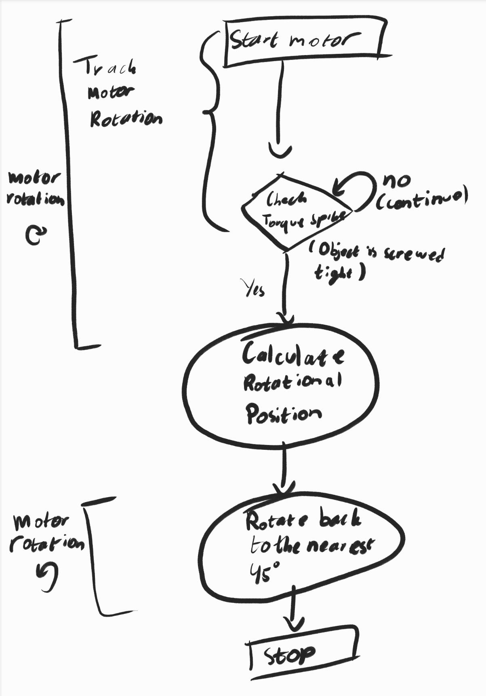

# Waveshare ST3215 Motor Control / Waveshare ST3215 モーター制御

This project contains Python scripts to control Waveshare ST3215 Bus Servos using a Raspberry Pi. It includes a custom driver and a main script to demonstrate movement with stall detection.
（このプロジェクトには、Raspberry Piを使用してWaveshare ST3215バスサーボを制御するためのPythonスクリプトが含まれています。カスタムドライバと、ストール検出を伴う動作をデモンストレーションするメインスクリプトが含まれています。）

## Requirements / 必須要件

*   **Hardware / ハードウェア**:
    *   Raspberry Pi (e.g., Pi 4, Pi 5, Zero 2 W) / Raspberry Pi（例：Pi 4、Pi 5、Zero 2 W）
    *   Waveshare ST3215 Bus Servo / Waveshare ST3215 バスサーボ
    *   Servo Driver (e.g., Waveshare Bus Servo Adapter (A) or HAT) / サーボドライバ（例：Waveshare Bus Servo Adapter (A) または HAT）
    *   12V Power Supply / 12V 電源

*   **Software / ソフトウェア**:
    *   Python 3
    *   `pyserial` library / `pyserial` ライブラリ
    *   `tkinter` (Usually included with Python, but requires `python3-tk` on some Linux distros) / `tkinter` (通常Pythonに含まれていますが、一部のLinuxでは `python3-tk` が必要です)

## Installation / インストール

1.  **Clone the repository / リポジトリをクローン**:
    (Or download the files directly / またはファイルを直接ダウンロードしてください)

2.  **Install dependencies / 依存関係のインストール**:
    ```bash
    pip install pyserial
    ```

3.  **Enable Serial Port / シリアルポートの有効化**:
    *   Run `sudo raspi-config` / `sudo raspi-config` を実行します。
    *   Navigate to **Interface Options** -> **Serial Port** / **Interface Options** -> **Serial Port** に移動します。
    *   **Login shell**: No / **Login shell**: No を選択します。
    *   **Serial Port Hardware**: Yes / **Serial Port Hardware**: Yes を選択します。
    *   Reboot: `sudo reboot` / 再起動: `sudo reboot`

## Usage / 使い方

1.  **Connect the hardware / ハードウェアの接続**:
    *   Ensure the motor ID is set to `1` (default factory ID). / モーターIDが `1`（工場出荷時のデフォルトID）に設定されていることを確認してください。
    *   Connect the driver to the Raspberry Pi GPIO pins (TX/RX). / ドライバをRaspberry PiのGPIOピン（TX/RX）に接続します。

2.  **Run the script / スクリプトの実行**:
    ```bash
    python main_robot_control.py
    # or with uv / あるいは uv を使う場合:
    uv run main_robot_control.py
    ```

This script will launch a GUI window / このスクリプトはGUIウィンドウを起動します:
1.  **Status Display**: Shows current Time, Position, and Load. / **ステータス表示**: 現在の時間、位置、負荷を表示します。
2.  **START Button**: Starts the motor movement and monitoring. / **START ボタン**: モーターの動作と監視を開始します。
3.  **STOP Button**: Stops the motor immediately. / **STOP ボタン**: モーターを即座に停止します。
4.  **Stall Detection**: If a stall is detected, the status will red "STALL DETECTED!" and the motor will back off. / **ストール検出**: ストールが検出されると、ステータスが「STALL DETECTED!」になり、モーターが少し戻ります。

## Files / ファイル構成

*   `waveshare_driver.py`: Low-level driver class for ST3215/STS servos. / ST3215/STSサーボ用の低レベルドライバクラス。
*   `main_robot_control.py`: Main logic for movement and monitoring. / 移動と監視のためのメインロジック。

## Troubleshooting / トラブルシューティング

*   **No movement? / 動かない場合**:
    *   Check wiring (TX/RX might need to be swapped). / 配線を確認してください（TXとRXが逆になっている可能性があります）。
    *   Check `BAUD_RATE` (Default is 1000000). / `BAUD_RATE` を確認してください（デフォルトは 1000000 です）。
    *   Verify 12V power supply is connected. / 12V電源が接続されているか確認してください。
